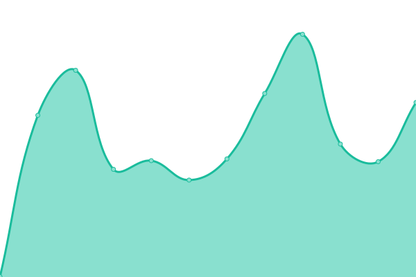
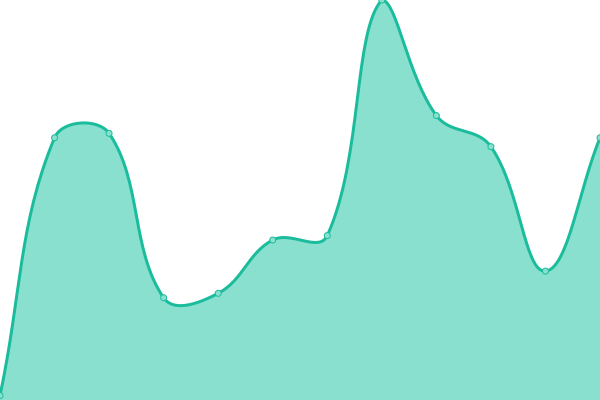
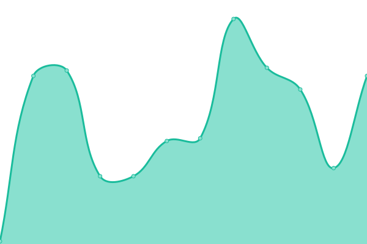

# [📈 Live Status](https://vaibhav0806.github.io/vala-backend-status): <!--live status--> **🟩 All systems operational**

This repository contains the open-source uptime monitor and status page for [Vaibhav](https://vaibhav0806.github.io/vala-backend-status), powered by [Upptime](https://github.com/upptime/upptime).

With [Upptime](https://upptime.js.org), you can get your own unlimited and free uptime monitor and status page, powered entirely by a GitHub repository. We use [Issues](https://github.com/vaibhav0806/vala-backend-status/issues) as incident reports, [Actions](https://github.com/vaibhav0806/vala-backend-status/actions) as uptime monitors, and [Pages](https://vaibhav0806.github.io/vala-backend-status) for the status page.

<!--start: status pages-->
<!-- This summary is generated by Upptime (https://github.com/upptime/upptime) -->
<!-- Do not edit this manually, your changes will be overwritten -->
<!-- prettier-ignore -->
| URL | Status | History | Response Time | Uptime |
| --- | ------ | ------- | ------------- | ------ |
|  [Overall Health](https://backend.vala.media/api/v1/health) | 🟩 Up | [overall-health.yml](https://github.com/vaibhav0806/vala-backend-status/commits/HEAD/history/overall-health.yml) | 

 380ms
     
 | 

<a href="https://vaibhav0806.github.io/vala-backend-status/history/overall-health">100.00%</a>
    

|  [Liveness](https://backend.vala.media/api/v1/health/liveness) | 🟩 Up | [liveness.yml](https://github.com/vaibhav0806/vala-backend-status/commits/HEAD/history/liveness.yml) | 

 67ms
     
 | 

<a href="https://vaibhav0806.github.io/vala-backend-status/history/liveness">100.00%</a>
    

|  [Readiness](https://backend.vala.media/api/v1/health/readiness) | 🟩 Up | [readiness.yml](https://github.com/vaibhav0806/vala-backend-status/commits/HEAD/history/readiness.yml) | 

 70ms
     
 | 

<a href="https://vaibhav0806.github.io/vala-backend-status/history/readiness">100.00%</a>
    

<!--end: status pages-->

[**Visit our status website →**](https://vaibhav0806.github.io/vala-backend-status)

## 📄 License

- Powered by: [Upptime](https://github.com/upptime/upptime)
- Code: [MIT](./LICENSE) © [Anand Chowdhary](https://anandchowdhary.com), supported by [Pabio](https://pabio.com)
- Data in the `./history` directory: [Open Database License](https://opendatacommons.org/licenses/odbl/1-0/)
